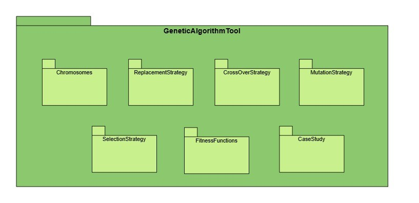
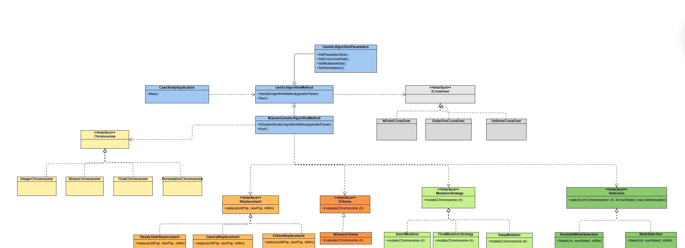

# Soft Computing Library

A Java library implementing **Genetic Algorithms**, **Fuzzy Logic Systems**, and **Neural Networks**.

---

## Project Structure

```
softComputingLibrary/
├── GeneticAlgorithm/
│   ├── Chromosomes/        # Binary, Float, Integer, Permutation
│   ├── CrossOverStrategy/  # NPoint, OrderOne, Uniform
│   ├── FitnessFunctions/   # IFitnessFunction, NQueens, Knapsack
│   ├── MutationStratgey/   # Float, Insert, Inversion
│   ├── Problem/            # GeneralGeneticAlgorithm, Parameters, NQueens
│   ├── ReplacementStratgey/# Elitism, Generational, SteadyState
│   └── SelectionStratgey/  # RankSelection, RouletteWheel
├── FuzzyLogic/
│   ├── Defuzzification/    # WeightAverageMean, MeanMax
│   ├── InferenceEngine/    # IEngine, MamdaniEngine, SugenoEngine
│   ├── MemberFunction/     # Triangle, Trapezoid
│   ├── Rule/               # IRule, MamdaniRule, SugenoRule, RuleStorage, RuleEditor
│   └── problem/            # Main, Mamdani, Sugino demos
├── NN/
│   ├── ActivationFunction/ # Sigmoid, ReLU, Tanh, Softmax, Linear
│   ├── DataHandlying/      # Normalize, OneHotEncoding, TrainTestSplit
│   ├── LossFunctions/      # CrossEntropy, MSE
│   ├── NeuralNetwork/      # NeuralNetwork, NeuralLayer
│   └── WeightsInitialization/ # Xavier, Random
├── mamdani.json / sugino.json / rules.json
└── iris_data.csv
```

---

## 🧬 Genetic Algorithm

Strategy-based GA framework — all components are pluggable via interfaces.

| Category | Options |
|---|---|
| **Chromosomes** | `BinaryChromosome`, `FloatChromosome`, `IntegerChromosome`, `PermutationChromosome` |
| **Selection** | `RankSelection`, `RouletteWheelSelection` |
| **Crossover** | `NPointCrossOver`, `OrderOneCrossOver`, `UniformCrossOver` |
| **Mutation** | `FloatMutationStrategy`, `InsertMutationStrategy`, `InversionMutationStrategy` |
| **Replacement** | `ElitismReplacement`, `GenerationalReplacement`, `SteadyStateReplacement` |

```java
GeneticAlgorithmParameters params = new GeneticAlgorithmParameters(
    100, 500, 8, 0.8, 0.05  // populationSize, generations, chromosomeLength, crossoverRate, mutationRate
);

GeneralGeneticAlgorithm<Integer> ga = new GeneralGeneticAlgorithm<>(params);
IFitnessFunction<Integer> ff = new N_QueensCaseStudyFitnessFunction(8);

Chromosome<Integer> best = ga.runGeneticAlgorithm(
    ff,
    new RankSelection<>(),
    new OrderOneCrossOver<>(),
    new InsertMutationStrategy<>(),
    new ElitismReplacement<>(),
    new PermutationChromosome(8, ff),
    ch -> ff.evaluate(ch) == 0,  // stop condition
    true,                        // isMinimization
    2                            // parents to select
);
```

A ready-to-run **N-Queens** case study is in `NQueensGeneticAlgorithmImplement`:

```java
new NQueensGeneticAlgorithmImplement(
    new GeneticAlgorithmParameters(100, 1000, 8, 0.9, 0.1)
).run();
```

Default strategy configuration for N-Queens:

| Component | Choice |
|---|---|
| Chromosome | `PermutationChromosome` |
| Selection | `RankSelection` |
| Crossover | `OrderOneCrossOver` |
| Mutation | `InsertMutationStrategy` |
| Replacement | `ElitismReplacement` |
| Fitness | Number of attacking queen pairs (target = 0) |

---

## 🔀 Fuzzy Logic

Supports **Mamdani** (fuzzy outputs) and **Sugeno** (expression-based crisp outputs). Rules are loaded from JSON and evaluated with a recursive interpreter supporting `&`, `|`, `not`, and arbitrary nesting.

**Rule format (`mamdani.json`):**
```json
{
  "type": "MamdaniRule",
  "enabled": true,
  "condition": "((Study_Preparation is Excellent & Subject_Difficulty is Easy) | Sleep_Quality is Excellent)",
  "consequence": "Stress_Level is Low"
}
```

```java
// Load rules
List<IRule> rules = new RuleEditor(new RuleStorage("rules.json")).getAll();

// Build input variable
FuzzySet fs = new FuzzySet();
fs.addMemberFunction(new TrapzoidFunction("small",  List.of(0.0, 0.0, 20.0, 40.0), ...));
fs.addMemberFunction(new TrapzoidFunction("medium", List.of(20.0, 40.0, 60.0, 80.0), ...));

// Fuzzify → Infer → Defuzzify
IEngine engine = new MamdaniEngine();
engine.fuzzify(List.of(60.0, 25.0), List.of(new Variable("dirt", fs, 0, 100)));
Map<String, Set<Pair>> results = engine.inferRules(rules, null);
Pair output = new WeightAverageMean<>().defuzzify(outputFuzzySet, results);
```

> Inputs are auto-clamped to variable bounds. `null` or `NaN` values default to the midpoint.

For **Sugeno**, consequences are math expressions evaluated via exp4j:
```json
{ "consequence": "output = 2*Speed + 3*Load" }
```

**Member functions:** `TriangleFunction([a, b, c])`, `TrapzoidFunction([a, b, c, d])`  
**Defuzzification:** `WeightAverageMean`, `MeanMax`

---

## 🧠 Neural Network

Feedforward network with backpropagation, mini-batch training, and early stopping.

```java
NeuralNetwork nn = new NeuralNetwork(0.01, 200, 10, new CrossEntropy(), 0.001);
//                                    lr  epochs batch  loss             earlyStop

nn.addLayer(new NeuralLayer(5, 4, new ReluActivationFunction(),    new XavierInitializer()));
nn.addLayer(new NeuralLayer(3, 5, new SoftmaxActivationFunction(), new XavierInitializer()));

nn.train(X_train, Y_train);
ArrayList<ArrayList<Double>> preds = nn.predictBatch(X_test);
```

| Category | Options |
|---|---|
| **Activation** | `Sigmoid`, `ReLU`, `Tanh`, `Softmax`, `Linear` |
| **Loss** | `CrossEntropy`, `MeanSquaredErrorLoss` |
| **Weight Init** | `XavierInitializer`, `RandomInitializer` |

**Preprocessing pipeline:**
```java
table = new OneHotEncoding(table).encode();
List<Table> split = new TrainTestSplit(table).split(0.8);
NormalizeValues norm = new NormalizeValues(trainFeatures);
Table X_train = norm.normalize();
Table X_test  = norm.apply(testFeatures);  // uses train statistics
```

A complete **Iris classification** case study is in `NN/CaseStudy/Main.java`:

**Architecture:** `Input(4) → Hidden(5, ReLU) → Output(3, Softmax)`  
**Loss:** Cross-Entropy | **Weight Init:** Xavier | **Dataset:** `iris_data.csv`  
**Classes:** `Iris-setosa`, `Iris-versicolor`, `Iris-virginica`

Training output:
```
Epoch 1/200  - Loss: 1.0823
Epoch 2/200  - Loss: 0.9914
...
Target loss reached! Stopping early.
Test Accuracy: 0.9667
```

---

## Diagrams

### Package Diagram


### Class Diagram


---

## Dependencies

| Module | Library | Version |
|---|---|---|
| Fuzzy Logic | `gson` | 2.11.0 |
| Fuzzy Logic | `exp4j` | 0.4.8 |
| Neural Network | `tablesaw-core` | 0.38.1 |
| Neural Network | `commons-math3` | 3.6.1 |
| Neural Network | `slf4j`, `guava`, `univocity-parsers` | various |

All JARs are bundled under `FuzzyLogic/lib/` and `NN/lib/`.

---

## Contributing

Contributions are welcome! Feel free to open issues or submit pull requests for new strategies, additional case studies, or improvements to existing modules.

---

## License

This project is open-source. See the `LICENSE` file for details.
